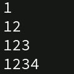
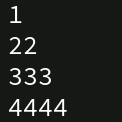

#  C++ Programming

This repository contains a list of **simple, well-documented codes** starting from the very basics — perfect for self-learning or classroom reference.

---

## About the Repository
- Covers **basic C++ programs** in a **step-by-step** manner.
- Each program includes:
  - **Description** of the problem.
  - **Formula** (if applicable).
  - **Sample Output**.
  - **source code**.

---

## List of Programs

- [Program to add two numbers](codes/add-two-numbers.cpp)
- [Program to find area of Circle](codes/area-of-circle.cpp)
- [Program to find area of Rectangle](codes/area-of-ractangle.cpp)
- [Program to convert binary to decimal numbers](codes/binary_to_decimal.cpp)
- [Program to create a basic Calculator](codes/calculator.cpp)
- [Program to convert degree celsius to fahrenheit](codes/celsius-to-fahrenheit.cpp)
- [Program to convert decimal to binary numbers](codes/decimal_to_binary.cpp)
- [Program to check if program is even or odd](codes/even-or-odd.cpp)
- [Program to find factorial of number](codes/factorial-of-number.cpp)
- [Program to convert fahrenheit to degree celsius](codes/fahrenheit-to-celsius.cpp)
- [Program to convert octal to binary numbers](codes/octal_to_binary.cpp)
- [Program to find percentage of five numbers](codes/percentage-of-five-num.cpp)
- [Program to find perimeter of rectangle](codes/perimeter-of-rectangle.cpp)
- [Program to check if a number is prime or not](codes/prime-number-or-not.cpp)
- [Program to reverse a number (with loop)](codes/reverse-number-with-loop.cpp)
- [Program to freverse a number (without loop)](codes/preverse-number-without-loop.cpp)
- [Program to find sum of individual digits of five numbers](codes/sum-of-digits-of-five-digits-num.cpp)
- [Program to swap two numbers using third variable](cpdes/swap-two-numbers-using-variable.cpp)
- [Program to swap two numbers without using third variable](codes/swap-two-numbers-without-third-variable.cpp)
- [Program to find fibonacci number of nth term](codes/fibonacci.cpp)
- [Program to find factorial of a number via recursion](codes/factorial.cpp)
- [Program to check whether character is uppercase or lowercase](codes/uppercase-or-lowercase.cpp)
### Nested Loops Patterns ↓
- [Program to create upper left triangle star pattern](codes/loop-patterns/upper-left-triangle.cpp)
- [Program to create lower left triangle star pattern](codes/loop-patterns/lower-left-triangle.cpp)
- [Program to create square star pattern](codes/loop-patterns/square.cpp)
- [Program to create following triangle pattern](codes/loop-patterns/triangle-pattern.cpp)
- 
- [Program to create following triangle pattern](codes/loop-patterns/triangle-pattern2.cpp)
- 
- [Program to create floyd's triangle](codes/loop-patterns/floyd-triangle.cpp)
- 
---
<br>

## To add your code follow these steps

### 1. Clone the Repository
```bash
git clone https://github.com/sahilvirdi01/cpp-programming.git
cd cpp-programming/
```
### 2. Make a new git branch
Create a new branch of your name to keep the code and history clean. 
```bash
git checkout -b <your-name>
#This will create a new branch and automatically switch to it
```
 - replace your-name with your actual name to create a new branch
### 3. Add your code 
```bash
cd codes/
#Add your code to this folder
```
### 4. Stage and commit changes
```bash
git add <filename>
#OR
git add .
git commit -m "Added <filename.cpp>"
```
### 5. Push the branch
```bash
git push origin <branch-name>
```
 - replace the branch-name wth name of your branch you just created.

### 6. Create a pull request on Github
#### Github --> Compare & Pull Request --> Merge after review
---

## Issues
- If you find any bugs or have suggestions, feel free to [create an issue](../../issues) in this repository.
- This project is **open-source** and available for everyone to use, modify, and share.

<br>


